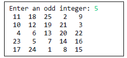

# C++ Programming For Science - Assignment 3

This template repository is the starter project for C++ Programming For Science Assignment 3. Written in C++, and tested with CMake/Catch2.

### Question(s)

1. Write a C++ function will create an array of an specified size. Then, start filling the array using startingInteger in the last position and incremented by 3 for each previous position. Once this is done rotate all the entries with even indexes 2 positions to the left (if the size is 5, whatever is in index location 4 is stored in index position 2, whatever is in 2, is stored in index position 0, and so on). The first entry is to be stored in the last location (size -1) of the array. Display the resulting array (for your testing purposes only). Return the array after rotation.  

  

Note 1: You are to expect a perfect user who will always enter an odd array size; that is, do not verify the validity of user input.

Note 2: Your program must work for any odd array size and starting value, not just the ones in the samples above.

Note 3: You are free to use whichever type of loop you want.

2. A magic square is an N-by-N matrix of the integers, such that all row, column, and diagonal sums are equal. For example,  

4 9 2  
3 5 7  
8 1 6  

is a magic square, because the sum of row is 15 (4+9+2 = 15) and, 3+5+7 = 15, 8+1+6 = 15), and the sum of each column is 15 (4+3+8=5, 9+5+1=15, 2+7+6 = 15) and the sum of the 2 diagonals is 15 (4+5+6 = 15, 2+5+8 = 15).

Write a C++ function to test if a matrix represents a magic square.

3. One way to generate a magic square of size n, when n is odd is to assign the integers 1 to n^2 in ascending order, starting at the bottom, middle cell. Repeatedly assign the next integer to the cell adjacent diagonally to the right and down. If this cell has already been assigned another integer, instead use the cell adjacently above. If the new column is outside the square start back at the first column. If the new row is outside the square, start back at the beginning of the row.  

Write a C++ function to generate a magic square of a given odd size. For example, if the user enters 3, you should generate:  

  

If the user enters 5, you should generate:

  

### Setup Command

`make clean`

### Run Command

`make test`